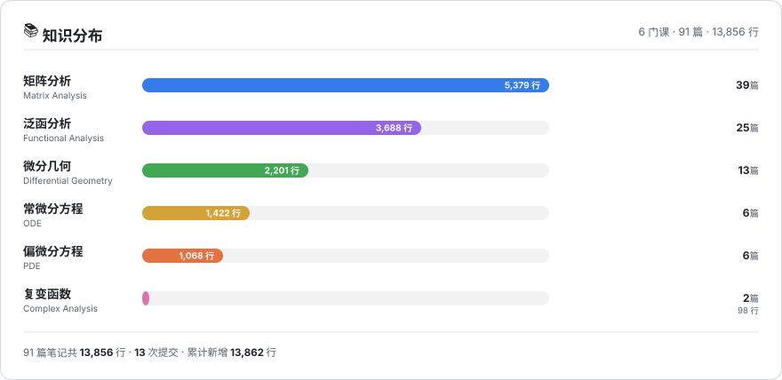

<h1 align="center">你好，我是 lisdscn 👋</h1>

  <b>数学 · 笔记驱动型学习</b> 
  <i>把每一节课用 Markdown 重新推导一遍 —— 写下来，才算真的懂。</i>

  
  
  
  
  

  <a href="#-我在学什么">📚 所学知识</a> ·
  <a href="#-我的贡献">📈 我的贡献</a> ·
  <a href="#-笔记怎么写的">✍️ 笔记方法论</a> ·
  <a href="#-路线图">🧭 路线图</a>

---

## 📚 我在学什么

> 全部笔记 → **[lisdscn/math-of-li](https://github.com/lisdscn/math-of-li)**
> 目录约定 `math.md/<课程>/<科目缩写><章><节>.md`，例如 `ma0401` = 矩阵分析 第 4 章第 1 节。

<table>
<tr>
<td width="50%" valign="top">

<h3>📐 矩阵分析</h3>

`38 篇` · `5,319 行` · `+5,326 行`

主线：**Horn & Johnson《Matrix Analysis》**

- **Ch.0 预备** — 向量空间 · 矩阵 · 行列式 · 秩 · 内积与范数 · 分块矩阵 · 复合矩阵 · Cramer 法则 · 基变换
- **Ch.1 特征值** — 特征多项式与代数重数 · 相似性 · 左右特征向量与几何重数
- **Ch.2 酉相似与酉等价** — QR 分解 · Schur 三角化 · 正规矩阵 · **SVD 奇异值分解** · CS 分解
- **Ch.3 相似标准型** — **Jordan 标准型** · 极小多项式与友矩阵 · 实 Jordan / Weyr 标准型
- **Ch.4 Hermite 矩阵** — 特征刻画 · **变分特征** · 子空间的交

</td>
<td width="50%" valign="top">

<h3>🧭 泛函分析</h3>

`25 篇` · `3,688 行` · `+3,688 行`

主线：**距离空间 → 赋范空间 → Hilbert 空间 → 算子**

- **Ch.1 距离空间** — 收敛与极限 · 开集与连续映射 · 闭集 / 可分性 / 列紧性 · 完备与完备化 · 闭球套定理
- **Ch.2 赋范空间** — 范数 · 完备赋范空间（Banach） · 几何结构（凸集） · 有限维性质 · 等价范数
- **Ch.3 内积与 Hilbert 空间** — 正交与正交分解 · 正交系与正交基 · **Bessel 不等式** · 可分性
- **Ch.4 有界线性算子** — 有界线性算子与泛函 · **一致有界准则**

</td>
</tr>
<tr>
<td width="50%" valign="top">

<h3>🌀 微分几何</h3>

`13 篇` · `2,201 行` · `+2,201 行`

主线：**曲线论 → 曲面论 → 活动标架**

- **Ch.1 欧氏空间** — 向量空间 · 内积结构
- **Ch.2 曲线的局部理论** — 曲线的概念 · $E^3$ 的曲线 · **曲线论基本定理**
- **Ch.3 曲面的局部理论** — 第一 / **第二基本形式** · 法曲率与 Weingarten 变换 · 主曲率与 **Gauss 曲率** · 典型曲面
- **Ch.4 标架与曲面论基本定理** — 活动标架 · 曲面的结构方程

</td>
<td width="50%" valign="top">

<h3>⏱️ 常微分方程</h3>

`6 篇` · `1,422 行` · `+1,420 行`

主线：**存在性 → 结构 → 积分**

- **Ch.1 基本概念** — 微分方程及其解的定义
- **Ch.2 初等积分法** — 恰当方程 · 积分因子
- **Ch.3 存在与唯一性定理** — **Picard 存在唯一性定理**
- **Ch.5 高阶微分方程** — 自治方程降阶
- **Ch.6 线性微分方程组** — 齐次 / 非齐次 · 解空间结构
- **Ch.10–11 首次积分**

</td>
</tr>
<tr>
<td width="50%" valign="top">

<h3>🌊 偏微分方程</h3>

`6 篇` · `1,068 行` · `+1,068 行`

主线：**分类 → 特征线 → 波动方程**

- **Ch.1 绪论** — 基本概念 · 二阶半线性方程的分类与**标准型**
- **Ch.2 一阶拟线性方程** — 一般理论 · **传输方程**（含非齐次）
- **Ch.3 波动方程** — 一维波动方程初值问题 · **Sturm–Liouville 特征值问题**

</td>
<td width="50%" valign="top">

<h3>🪞 复变函数 🚧 进行中</h3>

`2 篇` · `98 行` · `+99 行`

主线：**从复数域出发**

- **第 1 节 复数域** — 复数域 · **扩充复平面及其拓扑**
- 状态：2026-09 开坑，后续将补全解析函数 / 积分 / 级数 / 留数

 

> 学习顺序并非按上表，而是**跟着课程走、每节课当天成稿**。

</td>
</tr>
</table>

---

## 📈 我的贡献

### 数字一览

| 指标 | 数值 |
| :--- | ---: |
| 笔记总篇数 | **90 篇** |
| 手写笔记行数 | **13,796 行** |
| 累计提交新增 | **+13,802 行** |
| Git 提交数 | **11 次** |
| 学习跨度 | **2026-06-07 → 2026-09-15**（101 天） |
| 起始仓库 | [`math-of-li`](https://github.com/lisdscn/math-of-li) |

---

## ✍️ 笔记怎么写的

每篇笔记都遵循同一套结构，保证**可复习、可检索、可自洽**：

1. **定义先行** — 每个概念先用自然语言说清"它想解决什么问题"，再上形式化定义。
2. **定理 + 证明骨架** — 不抄书，只保留关键构造；跳步的地方补一句"为什么能这么做"。
3. **LaTeX 排版** — 公式全部用 `$...$` / `$$...$$`，与教材记号保持一致。
4. **目录即索引** — 文件名编码章节目录（如 `fa0304` = 泛函分析 3.4），按名排序即为学习顺序。
5. **习题单独归档** — 例如 [`习题2.md`](https://github.com/lisdscn/math-of-li/blob/main/math.md/泛函分析.md/习题2.md)。
6. **PDF 同步导出** — 重点章节（常微分 Ch.5–11、微分几何 4.3、泛函 4.1–4.2、偏微分 3.3）同时留了导出 PDF。

---

## 🧭 路线图

| 状态 | 内容 |
| :---: | :--- |
| ✅ | 矩阵分析 §0 – §4.2 · 泛函分析 §1 – §4.3 · 微分几何 §1 – §4.3 · 常微分 Ch.1 – Ch.11 |
| 🚧 | 矩阵分析 §4.3+ · 偏微分方程 §3.3+ · 复变函数全篇 |
| 📅 | 泛函分析 Ch.5（算子谱理论）· 偏微分方程 Ch.4（椭圆 / 抛物方程） |
| 💡 | 为每门课补一份「知识点索引 README」与「公式速查表」 |

---

  📖 笔记持续更新中 —— 如果这些推导对你有帮助，欢迎 Star ⭐ 
  <a href="https://github.com/lisdscn/math-of-li">math-of-li</a> · 最后更新 2026-09-15

